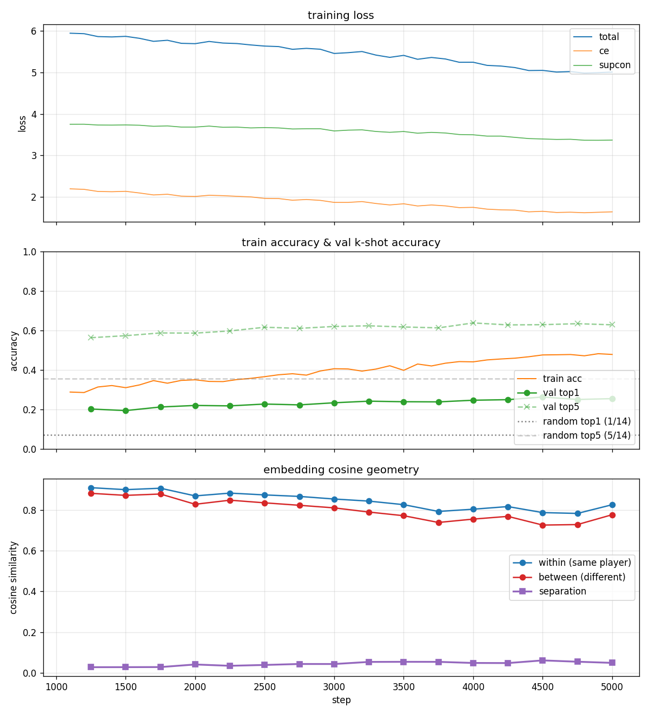
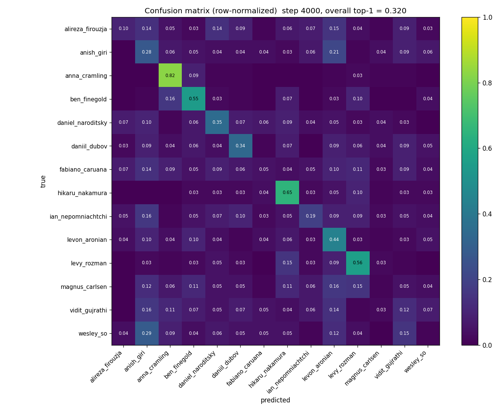
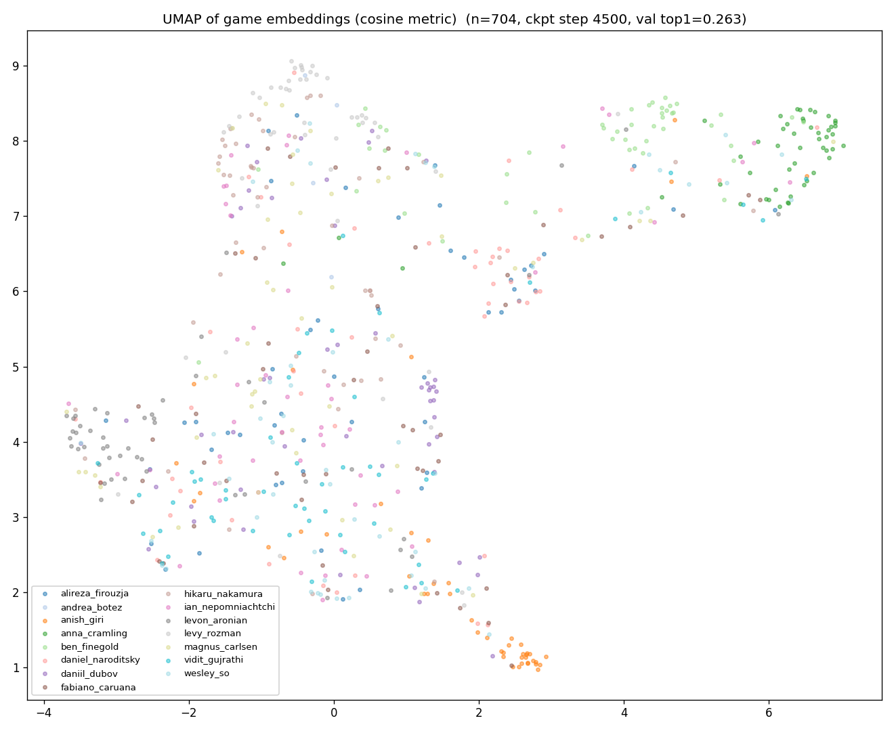

# chessfp — Chess Fingerprint

> Identify a chess.com player from their moves alone, and tell anyone *which pro they play like*.

```
$ python scripts/playlike.py Hikaru --since 2025-09 --top-k 5

=== style match for @Hikaru (2,663 games) ===
rank  pro                           cos   spread  bar
   1.  hikaru_nakamura           +0.913    1.00   ########################################   ← correct
   2.  levy_rozman               +0.913    1.00   #######################################
   3.  andrea_botez              +0.892    0.85   ##################################
   4.  fabiano_caruana           +0.880    0.77   ##############################
   5.  ian_nepomniachtchi        +0.880    0.77   ##############################
```

A behavioral-stylometry model that fingerprints chess.com pros and streamers (Magnus, Hikaru, Naroditsky, GothamChess, Firouzja, Anna Cramling, Ben Finegold, ...) from their move sequences alone. Trained from scratch on **124,599 games / 5.7M decisions** scraped from the chess.com public API.

End-to-end pipeline: scrape → encode 18-channel board + 6-channel move tensors → CNN-per-decision → transformer-per-game → contrastive embedding. ~3.4M parameters, trains on Apple Silicon MPS in ~2 hours.

## Visual story

**1. The training curve** — val top-1 climbs from 7.1% random to 26.9% over 5,000 steps. The cosine separation between embeddings of different players (purple, bottom panel) grows monotonically — the model is genuinely learning style geometry.



**2. Confusion matrix** — per-player identification accuracy (row = true player, column = predicted). Best result on the full corpus.



The big surprise: **streamers and pedagogical players are trivial to identify; elite super-GMs are essentially inseparable from each other.** Anna Cramling: 83% per-class accuracy. Hikaru: 65%. Levy: 56%. Magnus Carlsen: **1%**. Wesley So: 1%. Fabiano Caruana: 5%.

This is a real finding, not a training failure — elite super-GMs converge on engine-approved play and produce decision distributions that overlap so heavily they form a single behavioral cluster. We confirmed this across every loss function we tried (CE, SupCon, ArcFace, CE+SupCon, ArcFace+SupCon) and across `max_len ∈ {128, 256}`.

**3. UMAP of game embeddings** — the Anna Cramling cluster (dark green, far right) is visibly distinct. The elite-GM blob lives in the center-left.



## Headline numbers (14 players, val split)

| Model                  | val top-1 | top-5  | centroid acc | sep    | best at  |
|------------------------|----------:|-------:|-------------:|-------:|:--------:|
| Random baseline (1/14) | 0.071     | 0.357  | —            | —      | —        |
| CE+SupCon, max_len=128 | 0.263     | 0.629  | **0.343**    | +0.061 | step 4500|
| ArcFace fine-tune      | 0.268     | 0.620  | 0.329        | +0.034 | step 5250|
| **ArcFace+SupCon FT**  | **0.269** | 0.623  | 0.329        | +0.044 | step 5000|
| CE+SupCon, max_len=256 | 0.252     | 0.627  | 0.320        | +0.056 | step 3750|

Best val top-1: **3.8× random**. McIlroy-Young (NeurIPS 2021) hit 98% accuracy on 2,500 Lichess players with millions of games per player; we hit 27% on 14 chess.com pros with ~5k–35k games each. The gap is data scale, not architecture.

## Why this exists

McIlroy-Young et al. showed behavioral stylometry in chess works incredibly well — but their work used Lichess amateurs, not chess.com pros, and was never productized. This project is the polished, public-facing version focused on the **chess.com pro/streamer ecosystem**.

See [`LEARNINGS.md`](LEARNINGS.md) for the full engineering journey including:

- **Why the model didn't learn at all for ~6 hours** (global average pool over the 8×8 CNN feature map was destroying the per-square spatial info — flatten+linear was the breakthrough)
- **Why SupCon-alone collapsed** (cold-start instability — needed CE supervision to break out)
- **Why ArcFace from random init was stuck at acc=0** (margin punishes the target class when embeddings aren't aligned with class weights — needed CE-pretrained backbone)
- **Why doubling `max_len` was a wash overall but +0.07 for Hikaru specifically** (his long blitz games actually used the extra context)

## What's in the box

```
chessfp/
├── src/chessfp/
│   ├── fetch.py       chess.com Published-Data API client (rate-limited, resumable)
│   ├── parse.py       JSON archive → ParsedGame, with filters
│   ├── encode.py      board / move → 24×8×8 uint8 tensor channels
│   ├── dataset.py     parquet reader
│   ├── model.py       CNN + transformer + optional classifier head
│   ├── loss.py        SupCon, ArcFace, variance regularization
│   └── train.py       PK-sampler + training loop + k-shot eval
├── scripts/
│   ├── fetch_games.py         CLI: pull archives
│   ├── build_dataset.py       CLI: parse → parquet
│   ├── train.py               CLI: training entry point
│   ├── playlike.py            CLI: who does this user play like?
│   ├── style_compare.py       CLI: cosine similarity between two users
│   ├── confusion_matrix.py    CLI: per-class confusion image
│   ├── visualize_embeddings.py CLI: PCA + UMAP projection
│   └── plot_history.py        CLI: training curve image
├── data/              gitignored — raw archives + parquets
├── checkpoints/       gitignored — trained model weights
├── viz/               saved visualizations
├── players.json       curated chess.com handles
└── requirements.txt
```

## Setup

```bash
python3 -m venv .venv
source .venv/bin/activate
pip install -r requirements.txt

# chess.com asks for contact info in your User-Agent
export CHESSFP_CONTACT="you@example.com"
```

## End-to-end run

```bash
# 1. Fetch games (16 active handles × 5 years ≈ 17 min, 800 MB)
python scripts/fetch_games.py --since 2021-01

# 2. Build training set (parses 124k games into 33 MB of parquet)
python scripts/build_dataset.py

# 3. Train (CE+SupCon, ~45 min on Apple Silicon MPS)
python scripts/train.py \
  --steps 1500 --eval-every 250 \
  --warmup-steps 200 --lr 3e-4 \
  --loss-mode ce+supcon --supcon-weight 0.5 \
  --n-players-per-batch 12 --games-per-player 4 \
  --out-dir checkpoints/full

# 4. Demo
python scripts/playlike.py YourHandle --since 2025-01 --top-k 10
```

For the best result: fine-tune from the CE+SupCon checkpoint with ArcFace+SupCon for another ~80 min:

```bash
python scripts/train.py \
  --steps 1500 --warmup-steps 100 --lr 1e-4 \
  --loss-mode arcface+supcon --arcface-margin 0.15 --supcon-weight 0.5 \
  --resume checkpoints/full/best.pt \
  --out-dir checkpoints/arcsup_ft
```

## Compare two users' styles

```bash
python scripts/style_compare.py Hikaru MagnusCarlsen --since 2025-01
```

Outputs cosine similarity between the two users' centroids, plus each one's top-3 pro matches, plus a "reference scale" of pro-vs-pro similarities so you know what's "close" in this embedding space.

## Data source

[chess.com Published-Data API](https://www.chess.com/news/view/published-data-api) — public, no auth required, free. Be polite: identify yourself with the `CHESSFP_CONTACT` env var, keep request rate ≲ 1/s.

## Prior art

- McIlroy-Young, Wang, Sen, Kleinberg, Anderson — *Detecting Individual Decision-Making Style: Exploring Behavioral Stylometry in Chess* (NeurIPS 2021). [paper](https://arxiv.org/abs/2208.01366) · [code](https://github.com/CSSLab/maia-individual)
- [Maia Chess](https://www.maiachess.com/) — same group, personalized human-move prediction.
- Khosla et al. — *Supervised Contrastive Learning* (NeurIPS 2020). [paper](https://arxiv.org/abs/2004.11362)
- Deng et al. — *ArcFace: Additive Angular Margin Loss for Deep Face Recognition* (CVPR 2019). [paper](https://arxiv.org/abs/1801.07698)

## License

MIT. See `LICENSE`.
